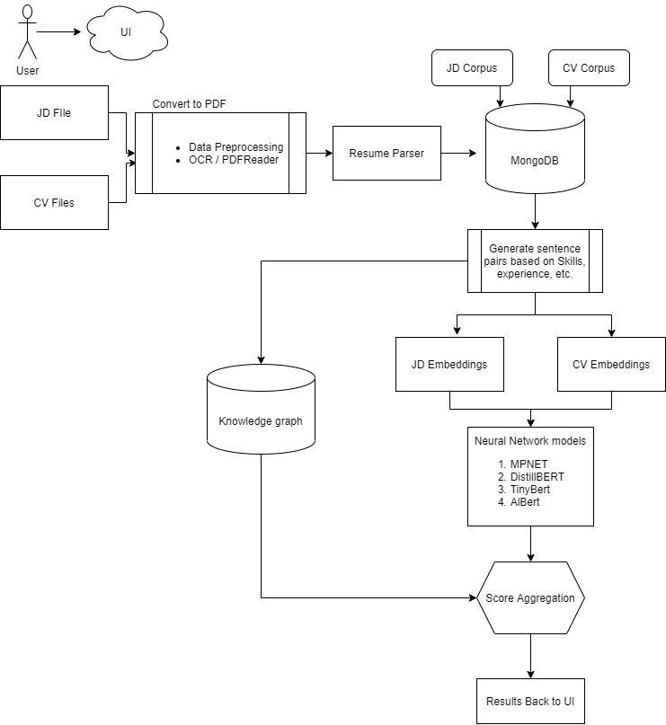

# Application Tracking system using Neural Networks

 ## Introduction
Any talent acquisition team faces the problem of dealing with an avalanche of applications whenever a new job opening arises. Only matching keywords and phrases automates some portions of the present application tracking system. As a result, resumes are ranked in a skewed manner, and the most worthy individual is not hired. This ATS applications ensures the most decerving candidates are shortlisted for the given position by using state-of-the-art neural network systems.



## Pipeline
The general flow of the pipeline is depicted in the flowchart above and is explained below : 
* A simple HTML form which takes as input the job description (JD) and Resumes (CVs). You can provide as many CVs for a particular position. (Accepted input : docx, pdf, img/jpg)
* The inputs from the user is then passed to an OCR(optical character recognition) system that captures the text from images. A resume parser is used to convert the text to structues Json data that captures the necessary fields from both JD and CV.
* The JSON record is then stored using MongoDB and then later accessed to create sentence pairs based on skills, experience etc.
* The sentence pairs are then cleaned using text processing and are passed to the transformers based models which encode the sentence pairs. The user interface allows the user to select from the available models.
* The sentence pairs are then evaluated using cosine similarity that captures how close or similar the two sentence are.
* Simultaneously, the knowledge graph captures the hierarchy of skills between the two sentences and gives it a score.
* The scores from the knowledge graph and the models are then aggregated and evaluated to get the best candidate for the given job description.
* The results are then displayed to the user for selection.

## Getting Started
#### Prerequisites
* Install MongoDB client and start the service locally. Go to MongoDB install directory -> bin -> Run mongo and mongod in two differnt terminals. 
```
Download the mongoDB Community .msi installer : https://www.mongodb.com/try/download/community?tck=docs_server.
Run the MongoDB installer.
Follow the MongoDB installation Wizard.
Install mongoDB as a service and also check the option to install mongoDB compass.
Install mongosh - https://docs.mongodb.com/mongodb-shell/install/
```
* Install all the python dependencies from requirements.txt
```
pip install -r requirements.txt
```
* Install Neo4j and Setup knowledge graph

Neo4j Desktop can be found at the Neo4j Download center and is available on Mac, Linux, and Windows.
https://neo4j.com/download-center/#desktop
Follow the guideline provided by the neo4j installer.
Open Neo4j Desktop -> Create a graph database -> Name it "KG_ATS" ->Open the terminal for that database under options -> Replicate the KG created for this project by using the command.

```
neo4j-admin load --from=<The path of neo4j dump present in /data/neo4j>

```

### Replicate the application in your local system
* Clone the repository to a directory in your local file system.
```
git clone https://github.com/Master-Thesis-BDBA/thesis-Rajath-SRH.git
```
* Perform the prerequiste as specified above. Ensure all the database service are up and running.
* Set up working directories in main/app.py
```
Update the upload folders to the "absolute path" of your system where the application is cloned. Note: This is the only manual change required to run the application locally.
UPLOAD_FOLD = '<PATHTO>/JD/'
UPLOAD_FOLD = '<PATHTO>/CV/'

JD = '<PATHTO>/JD/'
CV = '<PATHTO>/CV/'
```

* Run app.py. This will open a simple html form to input the JD and CVs. The application will take time to compute and display the scores.
```
python app.py
-- The application will be hosted locally. Open a browser with the specified port details. The application will present itself with a simple HTML form to enter JD and CV.

```

### Input data for test execution
Input data for test execution is available in /jd_upload and /cv_upload. A set of seven resumes and one job description are provided as input during the testing phase.
The job description is for a role that requires Data Science and its entire stack of skills. The job description describes a candidate who can provide an end-to-end solution for generating deep learning models, including visualization and the creation of business cases for the client.


Click the JD button to enter a maximum of one Job description.
Click the CV button to enter as many resumes to be compared with the chosen job description.
The application also allows the user to select the model for computation. When are all the inputs are chosen click submit. The application will take few minutes to calculate the scores for each resume and will finally aggregate the results all at once.

### Evaluation
Evaluation of the models based on various test cases suggest that MPNet model performs accurartely for sentence similarity tasks. However, the results of other models do not vary much compared to MPNet. The reason being that all of these architecures are modification and simplified version of the heavy packing BERT transformer model.


# Thesis Developed by
**Rajath Suresh Babu**
##### Email : rajathsuresh9@gmail.com

# Thesis Supervisors
**Prof. Dr. Ajinkya Prabhune** and
**Mr. Ashish Chouhan**
